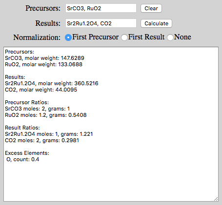

# Stoichiometer
JavaScript Stoichiometry Calculator

Online JavaScript calculator to obtain molar ratio and gram ratio of precursors required to obtain a desired result in solid-state chemistry.  As described at http://www.williamsonic.com/Stoichiometer/

